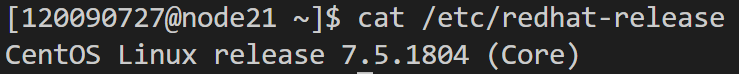

# Virtual File System Implementation with CUDA

Li Jiaqi  

The Chinese University of Hong Kong, Shenzhen

# Overview
This is a project for the [CSC3150: Operating Systems](http://www.cs.nthu.edu.tw/~ychung/syllabus/CSC3150-2022-Fall.htm) course taught in the Chinese University of Hong Kong, Shenzhen.

This project is aimed to implement a mechanism of file system management via
GPU's memory.

In this project, I have completed both the basic single-directory File System and the bonus task of a tree-structured directory File System. The following content will describe the relevant information of these two tasks I completed.

## Background
- File systems provide efficient and convenient access to the disk by allowing data to be
stored, located, and retrieved easily.  

- A file system should create algorithms and data structures to map the logical file
system on to the physical secondary-storage devices.   

- The file-organization module knows about files and their logical blocks, as well as physical
blocks. By knowing the type of file allocation used and the location of the file, the file organization module can translate logical block address to physical block address for the
basic file system to transfer.

- Each file’s logical blocks are numbered from 0 (or 1) through N. Since the physical blocks
containing the data usually do not match the logical numbers, a translation is required to
locate each block.

- The logical file system manages metadata information.

- Metadata includes all of the file-system structure except the actual data (or contents of the
files).

- The file-organization module also includes the free-space manager, which tracks
unallocated blocks and provides these blocks to the file-organization module when
requested.

- The logical file system manages the directory structure to provide the file-organization
module with the information the latter needs, given a symbolic file name. It maintains file
structure via file-control blocks.

- A file-control block (FCB) (an inode in UNIX file systems) contains information about
the file, including ownership, permissions, and location of the file contents.

Because there is no OS in GPU to maintain the mechanism of the logical file system,
we can try to implement a simple file system in CUDA GPU with single thread, and limit
global memory as volume.


# Environment

<!-- ## OS Version

I use the university’s High Performance Cluster (HPC) for testing and running the CUDA program. The nodes run on a CentOS version 7.5.1804. 

 -->

## CUDA Version

I use the CUDA compiler version 11.7 for compiling the CUDA program. 

<!--  -->

# Running the program

## Basic task compilation and running

To compile: inside the `source/` folder, there is a file named `slurm.sh`. On the HPC with slurm installed, we can directly use the shell script to compile and run the executable:

```
sbatch slurm.sh
```

On a device without slurm, one can first compile using 

```
nvcc --relocatable-device-code=true main.cu user_program.cu file_system.cu -o test
```

and run `./test` to run the program (might need `srun` in the cluster).

## Using the program
One can write user programs that gives commands to the file system by modifying the `user_program.cu`. Some usage samples have been provided there as well.

<!-- 
## Basic task sample outputs

On the first test program: (The first 36 lines are compiler warnings)


On the second test program: (The first 36 lines are compiler warnings)


On the third test program: (there are too many lines and we only display the begin, middle and end)


One the fourth test case: (there are too many lines and we only screenshot the beginning and end)


I checked that for test case 4, the `snapshot.bin` is the same as `data.bin`:


For test case 3, the `snapshot.bin` is the same as expected, where 


For test case 2 and 1, with the offset, the snapshots behave as expected:


## Bonus Task Compilation and running

Because the bonus task shares the same template structure with the basic task, the compilation and running steps are exactly the same as above, which means we could use:

```
sbatch slurm.sh
```

## Bonus task sample output

For test case 1 and 2, I have checked that the output as well as the snapshot comparison is the same as the basic task, please refer to the previous results.

For the bonus test case, the output is shown below, the first 91 lines are compiler warnings.

 -->

# Program Design

## Basic task design

In this CUDA program, we implement a single-directory file system using a limited GPU memory pool. The memory usage strictly obeys the one in the instruction, that no extra global memory is maintained or used. Temporary usage for function stack is limited. 

<p align="center">
  
    
</p>
<!--  -->

For the task, we allocate a volume of 1060kb with the 4kb volume control block using bitmap, 32kb for 1024 FCBs, each FCB is 32 bytes. The content of files use 1024kb, divided into storage blocks each 32 bytes.

### FCB Structure

Here is the FCB structure I used. Note that this does not create extra memory space, we just turn the specific portion of volume, originally `uchar*` to `FCB*` for better information storage and retrieval. I have tested that the `sizeof(FCB)` is 32, which is exactly the size of desired FCB. The attributes are self-explanatory.

    // **32 bytes** File control block. We will turn the FCB part in volume into (FCB*)
    // sizeof(FCB) is 32
    struct FCB {
        char filename[20];	// maximum size of filename is 20 bytes
        u32 size;	// the size of the file **in bytes**
        u16 modified_time;	// the last modified time
        u16 creation_time;
        u16 start_block_idx;	// the index of the first of its contiguous blocks
        bool is_on;
    };
<!--  -->

### Allocation strategy

The maximum file size allowed is the total content size of files, 1024 KB. I use dynamic, contiguous allocation together with compaction algorithm to maintain the FS. The dynamic scheme is to allow storing this maximum size of file. 

The contiguous allocation is one such that adjacent blocks store the file content sequentially, as illustrated in the figure: 
<p align="center">
  
    
</p>
<!--  -->

The compaction algorithm is utilized when there is fragmentation and a newly written file cannot file enough space. In my compaction algorithm implementation, I maintain a pointer to the first unused block and the first used block moving forward together. They are constantly swapped, which in effect “compacts” all the used blocks to the front. In the mean time, we update the FCB’s content block attribute.
<p align="center">
  
    
</p>
<!--  -->

Compaction algorithm

For the superblock, I use the bitmap, which uses one bit for one content block to indicate on or off. 

### Designing the APIs

All the required APIs `fs_open`, `fs_read`, `fs_write`, `fs_gsys` (including LS_S, LS_D, rm operations) are implemented. The `fs_open` returns an fp, which is the index of the FCB in the FCB array. Another interesting point is for the LS_D and LS_S operations. I did not use external storage for these two sorting operations. Instead, my implementation is simple, which is in each time, traverse all files and find the largest element that is not printed. This does not need to re-place the blocks. The following figure shows my implementation of `LS_D`. 


        
    // sort by modified time
    int last_item_time = (1<<15); // trace the time of last printed file
    // print the most recent modified file before the last item
    for (int i = 0; i < file_count; i++)
    {
    int latest_modified_time = 0;
    FCB latest_fcb;
    for (int j = 0; j < fs->FCB_ENTRIES; j++)
    {
        FCB fcb = START_OF_FCB[j];
        if (fcb.is_on && (fcb.modified_time > latest_modified_time) && (fcb.modified_time < last_item_time))
        {
        latest_fcb = fcb;
        latest_modified_time = fcb.modified_time;
        }
        
    }
    last_item_time = latest_fcb.modified_time;
    printf("%s\n", latest_fcb.filename);
    }
<!--  -->

The LS_S is more tricky but still uses the above idea. We do three traverses in total. First we traverse each item to get the largest unprinted size of files. Then we traverse to get the count of the largest size files. Then find the file with the file size of largest_file_size and the **earliest created time** among all unprinted items.

## Bonus task design

The bonus task is based upon the basic task with modification to add files for directories.

Firstly, we need to add a new attribute to trace the current working directory. I add to the `fs` struct.
    struct FileSystem {
        uchar *volume;
        int SUPERBLOCK_SIZE;
        int FCB_SIZE;
        int FCB_ENTRIES;
        int STORAGE_SIZE;
        int STORAGE_BLOCK_SIZE;
        int MAX_FILENAME_SIZE;
        int MAX_FILE_NUM;
        int MAX_FILE_SIZE;
        int FILE_BASE_ADDRESS;

        int cwd;	// current working directory's fcb index, **not** block index
    };
<!--  -->

Then, the FCB should be different to record each file’s directory index. 

We squeeze the `is_on` and `is_dir` 1-bit attribute to the first two bits of `u32 size`. So this is 32 bytes again.

    // File control block
    // this is 32 bytes. We turn the FCB portion in the volume into (FCB*). So no extra space
    struct FCB {
        char filename[20];	// maximum size of filename is 20 bytes
        u32 size;	// the size of the file **in bytes**
        u16 modified_time;	// the last modified time
        u16 creation_time;
        u16 start_block_idx;	// the index of the first of its contiguous blocks

        // if the FCB is a directory, it stores its parent dir index.
        // if the FCB is root directory, its parent dir index will be -1
        int16_t dir_idx;	// the index of the directory that the file is in; for a dir, it is its own idx
    };
<!--  -->

My implementation does not use extra global memory. Other implementations are similar to basic task. Because we record the file contents or subdirectory names in the content of directory, we need to traverse and check the filename match and the `dir_idx` match the cwd.

All required operations are supported, including the extra command `MKDIR`,  `PWD`, `CD` , `RM_RF` and `CD_P`, in addition to the ones in basic task.

My implementation also supports absolute addressing to increase robustness.

# Project reflection and conclusion

I think this project is a valuable experience for learning the FS, including dynamic allocation, contiguous allocation, compaction. I also learn the technique of writing CUDA programs, which are somewhat like C/C++ but have restricted access to some standard library routines, like `memcpy`.